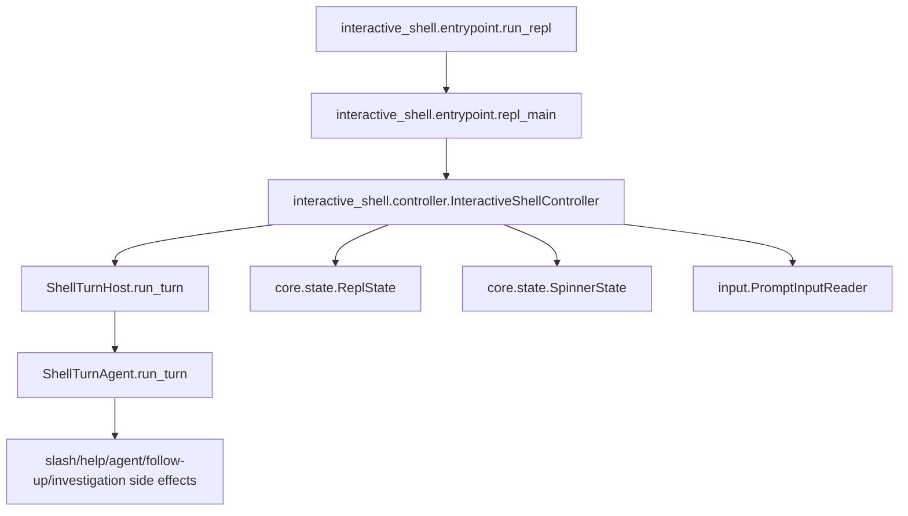

# Runtime package rules

## Human summary

The `runtime` package holds the focused support modules for the interactive
shell runtime. The top-level bootstrap and controller live one level up in
`interactive_shell/`.

In simple terms:

- `../entrypoint.py` starts the interactive session and handles startup/shutdown.
- `startup/first_launch_github.py` owns the first-launch GitHub sign-in gate.
- `../controller.py` owns the `InteractiveShellController` orchestration class,
  including prompt input, submitted prompt handling, queued turn consumption,
  prompt-mediated confirmation waits, one-turn pipeline handoff, background output draining, and
  shutdown.
- `core/prompt_manager.py` owns prompt-toolkit setup and prompt rendering.
- `input/` owns prompt input event conversion: EOF, Ctrl-C, CPR cleanup, and
  resume hints.
- `utils/input_policy.py` owns prompt stdin/spinner decisions for turns.
- `startup/initial_input.py` owns non-interactive initial-input replay.
- `background/workers.py` owns alert watching, spinner ticking, sampler startup,
  and turn-start background output drains.
- `background/` also owns background investigation records, launchers, and
  completion notification delivery.
- `core/` holds the core runtime engine:
  - `state.py` — shared runtime state (`ReplState`, `SpinnerState`)
  - `token_accounting.py` — LLM token usage and run metadata
  - `turn_detection.py` — pure text classifiers for cancel, confirm, and correction detection
- `core/tasks.py` owns the cross-session task registry surfaced via `/tasks` and
  `/cancel`.
- Per-REPL-process session state (`ReplSession`) and runtime context assembly
  (`ReplRuntimeContext`, `create_repl_runtime_context`) live in the
  `interactive_shell/harness/llm_context/session/` package, not in `core/`. `runtime/__init__.py`
  lazily re-exports those names (see compatibility surface policy below).

These instructions apply to `interactive_shell/runtime/` and all
subdirectories. Parent `AGENTS.md` files still apply.

## Architectural intent (locked)

The runtime package is intentionally split into focused concerns:

- `core/state.py` — runtime state and transition helpers only.
- `core/turn_detection.py` — pure prompt text classification only.
- `utils/input_policy.py` — terminal stdin/spinner gating decisions only.
- `agent_presentation.py` — terminal presentation for the agent turn only (agent
  lifecycle events, presentation-state reducer/renderer, `ConsoleAgentEventSink`,
  JSON-like assistant response rendering).
- `../controller.py` — stable async entrypoint and async prompt runtime/event loop
  orchestration, submitted prompt handling, queued-turn consumption,
  prompt-mediated confirmation waits, turn telemetry, one-turn pipeline
  handoff, background output draining, and shutdown only.
- `core/prompt_manager.py` — prompt-toolkit setup and prompt rendering only.
- `input/` — prompt input event conversion and terminal-input cleanup only.
- `background/workers.py` — background worker startup and turn-start drain hooks
  only.
- `background/models.py` — background investigation record and preferences only.
- `background/runner.py` — session-local background investigation launchers only.
- `background/notifications.py` — background RCA completion notification delivery only.
- `../entrypoint.py` — process/bootstrap boundary only.
- `startup/initial_input.py` — scripted initial-input replay only.
- `startup/first_launch_github.py` — first-launch GitHub sign-in gate only.
- `core/tasks.py` — task registry + persistence only.
- `core/token_accounting.py` — session-scoped LLM token accounting and run metadata only.

Keep these boundaries strict. If a change crosses concerns, move code to the
owner module instead of broadening module responsibilities.

## Data flow contract (locked)

The interactive runtime must keep this shape:

1. `interactive_shell.entrypoint.run_repl` sets up process-level concerns and calls `repl_main`.
2. `interactive_shell.entrypoint.repl_main` creates `InteractiveShellController`.
3. `InteractiveShellController.start_interactive_shell` owns prompt lifecycle,
   submitted input handling, queued-turn consumption, and per-turn task
   scheduling.
4. `runtime.turn_host.run_agent_turn_queue` runs each turn via an injected
   `run_turn` callable, which in production is `ShellTurnHost.run_turn`.
   `ShellTurnHost` holds the terminal/runtime dependencies (`session`, `state`,
   `spinner`, `invalidate_prompt`) directly; it owns shell presentation
   (console, spinner, recorder, progress scope), dispatch state, cancellation,
   and the thread-safe bridge from shell-agent events to terminal presentation.
   The persistent shell turn lifecycle lives in `harness/agent.py`
   (`ShellTurnAgent`), which emits `AgentEvent` objects from
   `harness/events.py`. Terminal presentation for those events lives in
   `runtime/agent_presentation.py` (`AgentPresentationState`,
   `_reduce_agent_presentation`, `_render_agent_presentation_transition`,
   `ConsoleAgentEventSink`, `render_json_like_response`).

Do not invert this dependency direction.

### Architecture diagram

## State ownership rules

- `ReplState` is the single source of truth for:
  - active dispatch task
  - cancellation event
  - confirmation event/response lifecycle
  - exit requests
  - the explicit turn `phase` (`TurnPhase`: `IDLE`, `DISPATCHING`,
    `AWAITING_CONFIRMATION`, `CANCELLING`)
- Mutate turn state through the `ReplState` transition methods, never by poking
  raw fields from other modules:
  - `start_dispatch` / `attach_turn_task` / `attach_cancel_event` -> `DISPATCHING`
  - `begin_confirmation` -> `AWAITING_CONFIRMATION`; `clear_confirmation` returns
    to `DISPATCHING`/`IDLE` (and never clobbers an in-progress `CANCELLING`)
  - `cancel_current_dispatch` -> `CANCELLING` (only when there is something to
    cancel) then signals the cancel/confirm events and `task.cancel`
  - `finish_dispatch` / `clear_current_task` -> `IDLE`
- `phase` is authoritative for confirmation and cancelling. `is_dispatch_running()`
  stays derived from the asyncio task (the runtime truth of the in-flight turn);
  `is_awaiting_confirmation()` and `is_cancelling()` are derived from `phase`.
- Do not reorder the signaling inside `cancel_current_dispatch` or move the
  `confirm_response` reset after the `confirm_event` publish in
  `begin_confirmation`; both orderings are load-bearing for cancellation and
  confirmation race-safety.
- `SpinnerState` owns spinner rendering state only; it must not depend on
  runtime task management.

## Turn execution rules

- Do not reintroduce `dispatch.py` or any compatibility-only forwarding module.
- The terminal host lives in `runtime/turn_host.py`: `ShellTurnHost.run_turn`
  owns shell presentation (StreamingConsole, spinner, recorder, progress scope),
  dispatch state, cancellation, and prompt-mediated confirmation. It constructs
  a `ConsoleAgentEventSink` and subscribes a thread-safe event bridge to
  `ShellTurnAgent`. The shell turn lifecycle and route state live in
  `harness/agent.py`: `ShellTurnAgent.run_turn` owns turn snapshots, observation
  reset, action/response routing, accounting finalization, and lifecycle event
  emission. Keep terminal side effects (spinner, prompt suppression,
  `console.print`, CPR drain) in `ConsoleAgentEventSink` — defined in
  `runtime/agent_presentation.py`, its imperative shell routes each event
  through the pure `_reduce_agent_presentation` and the effectful
  `_render_agent_presentation_transition`.
- Put cancel/confirm/correction text classifiers in `core/turn_detection.py`.
- Put stdin blocking and spinner decisions in `utils/input_policy.py`.
- Keep prompt-mediated confirmation waiting in `runtime/turn_host.py`.
- Turn accounting is consolidated behind `ShellTurnAccounting` in
  `interactive_shell/turn_accounting.py` (alongside the `ToolCallingTurnResult`
  and `ShellTurnResult` turn data model), invoked from `ShellTurnAgent`
  in `harness/agent.py`. It owns action-agent analytics, terminal-turn aggregate
  telemetry, prompt-recorder flush, conversational-turn persistence, and the final
  assistant-intent stamp. `run_tool_calling_turn` (in `harness/tool_calling.py`)
  returns facts only (`ToolCallingTurnResult` with `accounting_status` of
  `completed` / `not_run`) and emits no analytics itself. Do not re-scatter
  accounting back into `run_tool_calling_turn` or standalone `_record_*` helpers.

## Controller rules

- `../controller.py` owns:
  - `InteractiveShellController`
  - `start_interactive_shell` shell lifecycle orchestration
  - prompt input acceptance until exit
  - submitted prompt rendering and cancel/confirm/queue handling
  - queued turn consumption
  - per-turn task lifecycle
  - current turn cancellation helpers
  - coordination between prompt, background, and shutdown helpers
- `turn_host.py` owns:
  - `run_input_loop` — read and handle user input until exit
  - `run_agent_turn_queue` — consume queued turns until exit (runs an injected `run_turn`)
  - `ShellTurnHost` — terminal/runtime dependencies, presentation, dispatch state, prompt-mediated confirmation, and `ShellTurnAgent` invocation
- `agent_presentation.py` owns:
  - `ConsoleAgentEventSink` — terminal presentation for agent lifecycle events over `_reduce_agent_presentation` / `_render_agent_presentation_transition`
- `core/prompt_manager.py` owns:
  - prompt-toolkit wiring
  - prompt rendering callbacks
  - pending prompt defaults and autosubmit handling
- `input/` owns:
  - prompt input event types
  - terminal EOF and Ctrl-C conversion
  - CPR cleanup for submitted prompt text
  - session resume hints when prompt input closes
- `background/workers.py` owns:
  - alert watcher lifecycle
  - spinner ticker lifecycle
  - sampler startup
  - background notice drains at turn start
- Keep prompt rendering concerns in runtime/prompting modules, not in
  dispatch/execution.

## Entry-point rules

- `../entrypoint.py` owns:
  - startup sweep
  - TTY/non-TTY gate
  - banner display for interactive runs
  - alert listener setup/teardown
  - async boundary (`asyncio.run`)
- Do not move per-turn dispatch/runtime logic back into startup entrypoint.

## Compatibility surface policy

- `runtime/__init__.py` should be a thin export layer.
- Do not duplicate business logic in `__init__.py`.
- `runtime/__init__.py` lazily re-exports the session surface
  (`ReplSession`, `ReplRuntimeContext`, `create_repl_runtime_context`, …) from
  `context.session` via `__getattr__` (PEP 562). This is the one
  sanctioned indirection — it exists to avoid an import cycle
  (`session.context` depends on `runtime.core.state`). New code should import
  these names directly from `context.session`; the re-export only
  keeps existing `from interactive_shell.runtime import ReplSession` callers
  working.
- Do not re-add `_xxx` underscore aliases or wrapper functions for
  compatibility. Tests and callers should import canonical names from their
  owning submodule.

## Test seam policy

- Prefer patching canonical module seams:
  - `interactive_shell.controller.*` for prompt-loop, queued-turn, confirmation behavior,
    one-turn pipeline execution, and side effects
  - `interactive_shell.entrypoint.*` for process/bootstrap behavior
  - `runtime.core.state.*` for state-specific behavior
- Avoid adding new tests that monkeypatch package-root internals in
  `runtime.__init__` unless there is no stable canonical seam.

## Refactor guardrails

- No behavior changes to action-planning policy should be introduced from
  `runtime/` refactors.
- Keep interruption semantics unchanged:
  - Esc or bare cancel commands interrupt active dispatch
  - cancellation moves the turn to `TurnPhase.CANCELLING` and signals both the
    cancel event and any pending confirmation event before `task.cancel`
  - confirmation prompts are cancel-safe and never silently auto-confirm; a
    cancel during confirmation must not be downgraded back to `DISPATCHING`
- Preserve observability semantics (turn telemetry and turn summaries).
